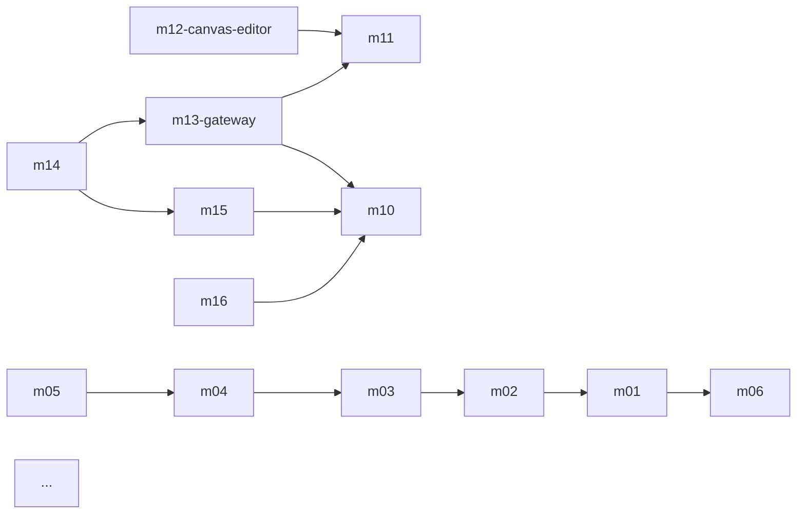

# Rust 技術スタック選択書

> **本文件は [DOC-ARCH-002 (01-tech-stack.md)](01-tech-stack.md) の Rust 詳細補完である。  
> 要件定義書 v1.2.1 §5「設計思想」、§7「非機能要件」を満たすため、Rust エコシステムの主要 crate を 1 つ 1 つ評価し、選定理由を明文化する。

> **ドキュメントID**：DOC-ARCH-007
> **文書分類**：横断文書
> **バージョン**：v1.0.0
> **制定日**：2026-08-19
> **最終更新日**：2026-08-19
> **作成者**：Ada プロジェクトチーム
> **レビュー**：TBD
> **承認**：TBD
> **上位文書**：`docs/legacy/requirements.md`（DOC-REQ-001）、`docs/legacy/basic-design.md`（DOC-BSC-001）、`docs/architecture/01-tech-stack.md`（DOC-ARCH-002）
> **下位文書**：`docs/architecture/01-tech-stack.md`（DOC-ARCH-002、補完関係）、`docs/architecture/04-atomic-deployment.md`（DOC-ARCH-005）
> **関連文書**：全 `docs/modules/M-XX`、全 `docs/api/`
> **適用 IPA 標準**：
> - IPA「共通フレーム2018」(SLCP-JCF2018) 第 6 章「システム開発プロセス」
> - IPA「非機能要求グレード2018」
> **機密区分**：社内
> **言語**：中文（简体）

---

## 改訂履歴

| バージョン | 日付 | 変更内容 | 起草 | レビュー | 承認 |
|---|---|---|---|---|---|
| v1.0.0 | 2026-08-19 | 初版制定（Rust エコシステム全面選定） | Ada プロジェクトチーム | TBD | TBD |

---

## 目次

1. 概要
2. 設計原則と非機能要件
3. Rust ツールチェーン
4. 非同期ランタイム — Tokio
5. Web フレームワーク — Actix-web
6. データベースアクセス — sqlx
7. データ型・シリアライゼーション — serde
8. エラーハンドリング — thiserror + anyhow
9. 可観測性 — tracing / metrics
10. 設定管理 — config
11. セキュリティ — 暗号化 / 認証
12. WebAssembly ランタイム — wasmtime
13. ブラウザ自動化 — Playwright
14. テストツールチェーン
15. ビルド・パッケージング
16. CI / 静的解析
17. Rust コード vs PL/pgSQL 境界
18. プロジェクト構造 — Cargo Workspace 設計
19. 採用判定記録（ADR）
20. リスクと対策
21. 验收要点
22. 用語集
23. 参考文献

---

## 1. 概要

本書は Ada 无限画布跨平台数据集成系统（Rust を主要開発言語とする）の **技術選定の全体像** を記録する。  
各技術領域について：

- **選定した crate / ツール** を明示
- **選定理由** を要件・性能・運用・生態系の 4 軸で説明
- **却下した代替案** を併記
- **設定例 / コード例** を提示

[DOC-ARCH-002 (01-tech-stack.md)](01-tech-stack.md) は簡潔な一覧表であったが、本書はその根拠・設定・トレードオフを詳述する補完文書である。

## 2. 設計原則と非機能要件

### 2.1 技術選定の 4 軸

| 軸 | 評価基準 |
|---|---|
| **要件** | requirements §7（NF-AVA/PER/OPS/MIG/SEC/ENV）を満たすか |
| **性能** | リアルタイム性、メモリ効率、スループット |
| **運用** | 監視性、デバッグ容易性、長期保守性 |
| **生態系** | コミュニティ規模、メンテナンス活発度、ドキュメント品質 |

### 2.2 主要非機能要件（再掲）

| 項目 | 要求水準 | NF タグ |
|---|---|---|
| 单画布 1,000 节点 30fps | 描画性能 | [NF-PER]【必須】 |
| 7×24 小时 連続稼働 | メモリリークなし | [NF-AVA]【必須】 |
| ブラウザ自動化 | Playwright 必須 | [NF-PER]【必須】 |
| 免安装分发 | 単一バイナリ / コンテナ | [NF-MIG]【必須】 |
| 凭证加密 | AES-256 | [NF-SEC]【必須】 |
| プラグイン热更新 | 推奨（任意） | [NF-OPS]【推奨】 |

## 3. Rust ツールチェーン

### 3.1 言語・エディション

| 項目 | 選定 | 理由 |
|---|---|---|
| **言語** | **Rust 1.74+** | 2024 年初頭の stable。async/await 成熟、edition 2021 安定 |
| **Edition** | **2021** | `IntoIterator for arrays` 等、Rust 2021 で安定化された機能を使用 |
| **MSRV** | **1.74** | CI で `cargo test --msrv 1.74` を実行、最低 1.74 でビルド可能を保証 |

**却下案**：
- **Edition 2024**（2024 年末 stable）→ 当面は 2021 で十分、新機能は個別 crate で対応

### 3.2 ビルドツール

| ツール | 用途 | 理由 |
|---|---|---|
| **cargo** | ビルド・依存解決 | 標準 |
| **cargo workspace** | マルチ crate 管理 | 16 モジュール × 1 crate の構造に最適（§18 参照） |
| **rustup** | ツールチェーン管理 | 標準 |
| **rust-analyzer** | LSP | エディタ統合 |
| **cargo-cache** | キャッシュ管理 | CI 高速化 |

### 3.3 共通依存関係（workspace レベル Cargo.toml）

```toml
# Cargo.toml (workspace root)
[workspace]
resolver = "2"
members = [
    "crates/m01-acquisition",
    "crates/m02-normalizer",
    "crates/m03-dataflow",
    "crates/m04-orchestration",
    "crates/m05-controlflow",
    "crates/m06-runtime",
    "crates/m07-debug",
    "crates/m08-trigger",
    "crates/m09-exporter",
    "crates/m10-tenant",
    "crates/m11-rbac",
    "crates/m12-canvas-editor",
    "crates/m13-gateway",
    "crates/m14-module-registry",
    "crates/m15-event-bus",
    "crates/m16-cluster",
]

[workspace.dependencies]
# バージョン管理を一元化（§4-§16 で参照）
tokio = { version = "1.40", features = ["full"] }
actix-web = "4.9"
actix-rt = "2.10"
sqlx = { version = "0.8", features = ["runtime-tokio-rustls", "postgres", "uuid", "chrono", "json"] }
serde = { version = "1.0", features = ["derive"] }
serde_json = "1.0"
thiserror = "1.0"
anyhow = "1.0"
tracing = "0.1"
tracing-subscriber = { version = "0.3", features = ["env-filter", "json"] }
tracing-actix-web = "0.7"
metrics = "0.23"
metrics-exporter-prometheus = "0.15"
config = { version = "0.14", features = ["toml", "yaml", "env"] }
wasmtime = "23.0"
playwright = "0.0.20"          # Playwright Rust binding
yrs = "0.18"                   # Yjs Rust port
bevy = { version = "0.14", features = ["bevy_egui"] }
bevy_egui = "0.28"
wasm-bindgen = "0.2"
uuid = { version = "1.10", features = ["v4", "v5", "v7", "serde"] }
chrono = { version = "0.4", features = ["serde"] }
ring = "0.17"
argon2 = "0.5"
libloading = "0.8"
wiremock = "0.6"
testcontainers = "0.20"
mockall = "0.13"
proptest = "1.5"
criterion = "0.5"
```

## 4. 非同期ランタイム — Tokio

### 4.1 選定：**Tokio 1.40**

Rust エコシステムの **事実上の標準** 非同期ランタイム。

### 4.2 評価マトリクス

| 候補 | 長所 | 短所 | 評価 |
|---|---|---|---|
| **Tokio** | 生态系最大、Actix-web/reqwest/sqlx/warp 等が採用、document 充実、enterprise 採用多数 | 「重量級」、学習コスト中 | ★★★★★ |
| **async-std** | API 直感的、Rust 標準的风格 | 生态系が Tokie に劣後、M-13 等の middleware crate がない | ★★ |
| **smol** | 軽量、組込向き | 同样に生态系薄い、本番大规模に向きにくい | ★★ |

### 4.3 主要依存 crate

| crate | 用途 |
|---|---|
| `tokio::sync::mpsc` | M-03 データフロー Engine 内部キュー |
| `tokio::sync::watch` | M-05 制御信号（Pause/Resume/Abort） |
| `tokio::sync::Semaphore` | M-01 BrowserPool / M-05 排他制御 |
| `tokio::time::interval` | M-08 Cron スケジューラ / M-16 ハートビート |
| `tokio::task::spawn` | 並列ノード実行 |
| `tokio::select!` | 複数ソースの待機（[M-04 编排引擎 §3.1](../modules/M-04-orchestration-engine.md) wait_for_external_event） |

### 4.4 設定例

```rust
// M-13 / M-04 共通 Runtime 構築
pub fn build_runtime() -> tokio::runtime::Runtime {
    tokio::runtime::Builder::new_multi_thread()
        .worker_threads(num_cpus::get())
        .thread_name("ada-worker")
        .enable_all()
        .build()
        .expect("failed to build tokio runtime")
}
```

### 4.5 NF タグ

- Tokio 採用で [NF-PER]【必須】（高スループット）、[NF-AVA]【必須】（安定動作）達成

## 5. Web フレームワーク — Actix-web

### 5.1 選定：**Actix-web 4.9**

M-13 API Gateway + 全 Admin API（[DOC-API-004/005/006](../api/)）。

### 5.2 評価

| 候補 | 長所 | 短所 | 評価 |
|---|---|---|---|
| **Actix-web** | 高速（TechEmpower ベンチ常連 Top）、middleware エコシステム成熟、Type-safe routing | 「古参」設計、axum に比べ新機能は遅い | ★★★★★ |
| **Axum** | Tokio 公式、tower エコシステム活用、型推論強力 | 0.x→1.0 移行期、生態系が Actix に劣る | ★★★★ |
| **Rocket** | 開発体験◎、macro 簡潔 | 0.5 まで async 不安定、生態系薄い | ★★★ |
| **Warp** | 関数型スタイル、軽量 | 学習コスト高、middleware 統合弱い | ★★ |

### 5.3 選定理由

- **M-13 §3.1 カスタム middleware**（CORS / JWT / tenant / RBAC）が必要 → Actix-web の `Transform` trait で全実装
- **admin-* 名前空間**の CRUD 多数 → `actix-web::web::scope` で整理
- **WebSocket** を `actix-web-actors::ws` で直接サポート → M-15 イベントストリーム

### 5.4 中間件実装例（[M-13 §3.1](../modules/M-13-api-gateway.md) 参照）

```rust
// TenantContextMiddleware（[DOC-MOD-010 §3.1](../modules/M-10-tenant-middleware.md)）
pub struct TenantContextMiddleware;

impl<S, B> Transform<S, ServiceRequest> for TenantContextMiddleware
where
    S: Service<ServiceRequest, Response = ServiceResponse<B>, Error = Error> + 'static,
    S::Future: 'static,
    B: 'static,
{
    type Response = ServiceResponse<B>;
    type Error = Error;
    type Transform = TenantContextMiddlewareInner<S>;
    type InitError = ();
    type Future = Ready<Result<Self::Transform, Self::InitError>>;

    fn new_transform(&self, service: S) -> Self::Future {
        ok(TenantContextMiddlewareInner { service })
    }
}

pub struct TenantContextMiddlewareInner<S> { service: S }

impl<S, B> Service<ServiceRequest> for TenantContextMiddlewareInner<S>
where /* 同上 */
{
    type Response = ServiceResponse<B>;
    type Error = Error;
    type Future = Pin<Box<dyn Future<Output = Result<Self::Response, Self::Error>>>>;

    forward_ready!(service);

    fn call(&self, req: ServiceRequest) -> Self::Future {
        let claims = extract_jwt_claims(&req).unwrap_or(...);
        req.extensions_mut().insert(TenantContext { /* ... */ });
        let fut = self.service.call(req);
        Box::pin(async move { fut.await })
    }
}
```

### 5.5 NF タグ

- [NF-PER]【必須】高スループット、[NF-SEC]【必須】middleware ベースの認証/認可

## 6. データベースアクセス — sqlx

### 6.1 選定：**sqlx 0.8**

**コンパイル時に SQL を検査** する Pure Rust な非同期 DB driver。

### 6.2 評価

| 候補 | 長所 | 短所 | 評価 |
|---|---|---|---|
| **sqlx** | コンパイル時 SQL 検証、async-native、no ORM、PL/pgSQL 直接呼出可 | クエリビルダ弱、ORM 機能ゼロ | ★★★★★ |
| **diesel** | 成熟的、型安全、コンパイル時検証 | 同期ベース、async 化が別途必要 | ★★ |
| **sea-orm** | Active Record 風、Rust らしい | 重い、async サポート追加されたばかり | ★★★ |
| **tokio-postgres** | 低レイヤ、Tokio 公式 | 型安全手書きが必要、SQL 検証なし | ★★★ |

### 6.3 選定理由

- **要件 §7.5 RLS** を生かすため、PL/pgSQL 呼出が必要 → `sqlx::query_as!` で SQL 文字列を直接記述
- **コンパイル時 SQL 検証** でタイプミスを CI で検出
- **async-native** で Tokio と完全統合

### 6.4 RLS トランザクション

```rust
// M-10 §3.1 with_tenant_scope
pub async fn with_tenant_scope<T, F, Fut>(
    pool: &PgPool,
    tenant_id: TenantId,
    f: F,
) -> Result<T, DbError>
where
    F: for<'c> FnOnce(&'c mut Transaction<'_, Postgres>) -> Fut,
    Fut: Future<Output = Result<T, DbError>>,
{
    let mut tx = pool.begin().await?;
    sqlx::query("SELECT set_config('app.current_tenant', $1, true)")
        .bind(tenant_id.to_string())
        .execute(&mut *tx)
        .await?;
    let result = f(&mut tx).await?;
    tx.commit().await?;
    Ok(result)
}
```

### 6.5 PL/pgSQL 呼出

```rust
// M-14 §3.4 register_module
let result = sqlx::query_as::<_, (bool, Uuid, Option<String>), _>(
    "SELECT * FROM register_module($1, $2, $3, $4, $5)"
)
.bind("m01-acquisition")
.bind("1.5.0")
.bind(serde_json::to_value(&manifest)?)
.bind("s3://...")
.bind("abc123...")
.fetch_one(&mut *tx)
.await?;
```

### 6.6 テスト時の DB 管理

| crate | 用途 |
|---|---|
| `sqlx::test` | テストごとの DB 自動セットアップ |
| `testcontainers` | PostgreSQL/Redis コンテナ起動 |
| `wiremock` | HTTP スタブ（外部 API） |

### 6.7 NF タグ

- [NF-PER]【必須】非同期 + 接続プール、[NF-SEC]【必須】PL/pgSQL による RLS 強制

## 7. データ型・シリアライゼーション — serde

### 7.1 選定：**serde 1.0 + serde_json 1.0**

**Rust エコシステムのデファクト** シリアライゼーションフレームワーク。

### 7.2 評価

| 候補 | 長所 | 短所 | 評価 |
|---|---|---|---|
| **serde** | 圧倒的生態系、#[derive] 簡潔、20+ フォーマット対応 | コンパイル時間長、generic 大量 | ★★★★★ |
| **simd-json** | SIMD 加速、serde 互換 API | 値型が限定的、unsafe | ★★★ |
| **nanoserde** | 軽量、no_std 対応 | 機能限定、複雑な型で動かない | ★★ |

### 7.3 用途

- **NJSON**（[requirements §8.1](../legacy/requirements.md)）の全 crate での受け渡し
- **REST API** リクエスト/レスポンス
- **WebSocket イベント** ペイロード
- **PostgreSQL JSONB** との相互変換

### 7.4 例：NJSON struct

```rust
// DOC-DTL-001 §3.1
#[derive(Serialize, Deserialize, Clone, Debug)]
pub struct NJson {
    pub schema_version: String,
    pub tenant_id: Option<TenantId>,
    pub workspace_id: Option<WorkspaceId>,
    pub source: SourceInfo,
    pub captured_at: DateTime<Utc>,
    pub payload: Payload,
    pub trace_id: TraceId,
}
```

### 7.5 NF タグ

- [NF-PER]【必須】高速シリアライズ、[NF-OPS]【必須】JSON 検証による契約遵守

## 8. エラーハンドリング — thiserror + anyhow

### 8.1 選定：**thiserror 1.0 + anyhow 1.0**

### 8.2 役割分担

| crate | 用途 | 適用場所 |
|---|---|---|
| **thiserror** | ライブラリ用 Error 派生 | 全 module の `Error` enum（[DOC-DTL-001 §14.1](../legacy/detailed-design.md) で 8 種類定義） |
| **anyhow** | アプリケーション用 Error 包装 | テスト / main / 一時スクリプト |

### 8.3 理由

- **thiserror**：ライブラリ API で Error 種別のバリアントを保つ（ダウンキャスト可能）
- **anyhow**：`Result<T, anyhow::Error>` で文脈付きエラーを伝搬

### 8.4 例（[M-01 §3.2 AdapterError](../modules/M-01-acquisition-adapter.md)）

```rust
use thiserror::Error;

#[derive(Debug, Error)]
pub enum AdapterError {
    #[error("该适配器不支持此操作")]
    Unsupported,
    #[error("API 与浏览器模式均不可用")]
    NoAvailableMode,
    #[error("登录态/凭证已过期")]
    AuthExpired,
    #[error("页面选择器未匹配到元素: {selector}")]
    SelectorNotFound { selector: String },
    // ...
}
```

### 8.5 NF タグ

- [NF-SEC]【必須】型安全なエラー処理、[NF-OPS]【必須】診断容易性

## 9. 可観測性 — tracing / metrics

### 9.1 選定

| crate | 用途 | 理由 |
|---|---|---|
| **tracing 0.1** | 構造化ログ / Span | async-native、Tokio 統合◎、OpenTelemetry bridge |
| **tracing-subscriber 0.3** | Subscriber | JSON 出力、env-filter、file rotation |
| **tracing-actix-web 0.7** | Actix リクエスト Span | M-13 リクエスト相関 |
| **metrics 0.23** | メトリクス facade | Prometheus exporter 標準 |
| **metrics-exporter-prometheus 0.15** | スクレイプエンドポイント | [M-03 §3.4](../modules/M-03-data-flow-engine.md) で `/metrics` 公開 |

### 9.2 ログ構造

```rust
use tracing::{info, instrument};

#[instrument(skip(self), fields(canvas_id = %canvas.id, tenant_id = %self.tenant_id))]
pub async fn execute_canvas(&self, canvas: &Canvas) -> Result<ExecutionId, OrchestrationError> {
    info!("canvas execution started");
    let exec_id = self.run_state_machine(canvas).await?;
    info!(execution_id = %exec_id, "canvas execution completed");
    Ok(exec_id)
}
```

### 9.3 Prometheus メトリクス例

```rust
// M-03 §3.4
use metrics::{counter, gauge, histogram};

pub fn record_event_throughput(edge_id: &str, count: u64) {
    counter!("ada_dataflow_throughput_total", "edge_id" => edge_id.to_string()).increment(count);
}

pub fn record_queue_depth(edge_id: &str, depth: usize) {
    gauge!("ada_dataflow_queue_depth", "edge_id" => edge_id.to_string()).set(depth as f64);
}
```

### 9.4 NF タグ

- [NF-OPS]【必須】ログ/メトリクス、[NF-AVA]【必須】障害検知

## 10. 設定管理 — config

### 10.1 選定：**config 0.14**（+ figment 0.10 補助）

### 10.2 階層（優先度順）

```
1. 環境変数（ADA_*）   ← 本番オーバーライド
2. /etc/ada/config.toml  ← システム設定
3. ./config/local.toml   ← 開発者ローカル
4. ./config/default.toml ← デフォルト
```

### 10.3 スキーマ例

```rust
#[derive(Debug, Deserialize)]
pub struct Settings {
    pub server: ServerSettings,
    pub database: DatabaseSettings,
    pub redis: RedisSettings,
    pub modules: ModulesSettings,
}

#[derive(Debug, Deserialize)]
pub struct DatabaseSettings {
    pub url: String,
    pub max_connections: u32,
    pub min_connections: u32,
}
```

### 10.4 NF タグ

- [NF-OPS]【必須】環境別設定切替、[NF-MIG]【必須】12-factor 準拠

## 11. セキュリティ — 暗号化 / 認証

### 11.1 選定

| crate | 用途 | 選定理由 |
|---|---|---|
| **ring 0.17** | AES-256-GCM、SHA-256、HMAC、RNG | Rust 製、安全監査済、OpenSSL より低依存 |
| **argon2 0.5** | パスワードハッシュ | PHC 受賞、推奨ストレッチング |
| **jsonwebtoken 9.3** | JWT 生成・検証 | 標準 HS256/RS256 対応 |
| **rustls 0.23** | TLS | OpenSSL 不要、pure Rust |

### 11.2 却下

| crate | 却下理由 |
|---|---|
| openssl | C 依存、ビルド複雑、メモリ安全でない |
| rust-crypto | メンテナンス停滞、ring に劣る |

### 11.3 凭证暗号化例

```rust
// M-10 §4.2 credential.encrypted_payload
use ring::aead::{Aead, AES_256_GCM, LessSafeKey, UnboundKey, Nonce};

pub fn encrypt_credential(plaintext: &[u8], key: &LessSafeKey, nonce_bytes: &[u8; 12]) 
    -> Result<Vec<u8>, CryptoError> 
{
    let nonce = Nonce::try_assume_unique_for_key(nonce_bytes)?;
    key.seal_in_place_append_tag(nonce, Aad::empty(), &mut plaintext.to_vec())
        .map_err(|_| CryptoError::SealFailed)
}
```

### 11.4 NF タグ

- [NF-SEC]【必須】多層防御

## 12. WebAssembly ランタイム — wasmtime

### 12.1 選定：**wasmtime 23.0**（wasmtime 公式）

### 12.2 用途

- **M-06 §3.2 WASM プラグイン実行**（ユーザー定義ノード）
- **M-14 §3.5.3 モジュールアーティファクト実行**（任意、SHA256 検証後）

### 12.3 主要 API

```rust
use wasmtime::*;

pub fn execute_wasm_plugin(
    module: &Module,
    input: NJson,
    limits: ResourceLimits,
) -> Result<NJson, PluginError> {
    let mut config = Config::new();
    config.consume_fuel(limits.max_cpu_time_ms);  // 燃料計量
    config.cache_config_load_default()?;
    let engine = Engine::new(&config)?;
    let mut store = Store::new(&engine, ());
    
    let instance = linker.instantiate(&mut store, module)?;
    let func = instance.get_typed_func::<(i32, i32), i32, _>(&mut store, "execute")?;
    
    // input 線形メモリに書き込み → 呼出 → output 読み出し
    let result = func.call(&mut store, (input_ptr, input_len))?;
    
    Ok(decode_output(result))
}
```

### 12.4 セキュリティ

- **Fuel 計量** で無限ループ防止
- **WASI 制限** で fs/network アクセス制御
- **Linear memory 隔離** で他プラグインへの干渉防止

### 12.5 NF タグ

- [NF-SEC]【必須】サンドボックス、[NF-PER]【必須】ネイティブと同等性能

## 13. ブラウザ自動化 — Playwright

### 13.1 選定：**playwright 0.0.20**（Playwright Rust 公式 binding）

### 13.2 評価

| 候補 | 長所 | 短所 | 評価 |
|---|---|---|---|
| **playwright** | 公式 Rust binding、API 安定 | crate バージョン若い（0.0.x） | ★★★★ |
| **thirtyfour** | 成熟、Selenium 風 API | Selenium WebDriver 依存、起動遅い | ★★★ |
| **fantoccini** | async-native、Tokio 統合 | API 複雑、生態系薄い | ★★ |

### 13.3 用途

- **M-01 §3.4 ブラウザモード采集**（[F-02 采集适配器](../modules/M-01-acquisition-adapter.md)）
- **ST E2E テスト**（[tests/ST-design.md §0](../tests/ST-design.md)）

### 13.4 構成

```
[Ada Process]
   └─→ [Playwright Driver (CDP via WebSocket)]
         └─→ [Headless Chromium]
               └─→ [Target Website (DOM)]
```

### 13.5 NF タグ

- [NF-PER]【必須】DOM 取得性能、[NF-SEC]【必須】沙箱隔離

## 14. テストツールチェーン

### 14.1 選定一覧

| 用途 | 選定 | 役割 |
|---|---|---|
| 単体テスト | `cargo test` | Rust 標準 |
| Mock 生成 | **mockall 0.13** | trait の mock 自動生成 |
| Property-based | **proptest 1.5** | ランダム入力ファジング |
| HTTP モック | **wiremock 0.6** | 外部 API スタブ |
| コンテナ統合 | **testcontainers 0.20** | PostgreSQL/Redis 自動起動 |
| パフォーマンステスト | **criterion 0.5** | ベンチマーク・回帰検出 |
| カバレッジ | **cargo-llvm-cov 0.6** | LLVM ベース、CI 統合 |

### 14.2 テスト戦略

- **UT**：`#[test]` + `#[tokio::test]` + mockall
- **IT**：`testcontainers` で DB 起動 + `sqlx::test` + wiremock
- **ST**：`tests/ST-design.md` §0 参照（Playwright E2E + k6 性能）

### 14.3 NF タグ

- [NF-PER]【必須】回帰検出、[NF-OPS]【必須】CI 統合

## 15. ビルド・パッケージング

### 15.1 選定

| ツール | 用途 | 選定理由 |
|---|---|---|
| **cargo build --release** | 通常ビルド | 標準 |
| **cargo-bundle** | バイナリパッケージ（.deb/.rpm/.dmg） | multi-OS 配布 |
| **musl libc** | 静的リンク | 免安装 (F-09) |
| **Docker (multi-stage)** | コンテナビルド | 本番 SaaS (F-17) |

### 15.2 musl 静的ビルド例

```bash
# Dockerfile (multi-stage)
FROM rust:1.74-alpine AS builder
RUN apk add musl-dev
RUN cargo install --target x86_64-unknown-linux-musl --path .

FROM scratch
COPY --from=builder /usr/local/cargo/bin/ada /ada
ENTRYPOINT ["/ada"]
```

### 15.3 バイナリサイズ最適化

```toml
# Cargo.toml [profile.release]
[profile.release]
opt-level = 3
lto = "fat"          # Link-Time Optimization
codegen-units = 1
strip = "symbols"    # デバッグシンボル削除
panic = "abort"      # unwind テーブル削除
```

### 15.4 NF タグ

- [NF-MIG]【必須】免安装、[NF-ENV]【必須】バイナリサイズ最小化

## 16. CI / 静的解析

### 16.1 選定

| ツール | 用途 |
|---|---|
| **cargo fmt** | コードフォーマット |
| **cargo clippy** | 静的解析（lint） |
| **cargo test** | テスト実行 |
| **cargo audit** | セキュリティ脆弱性 DB 照合 |
| **cargo deny** | 依存ライセンス監査 |
| **cargo-tarpaulin / cargo-llvm-cov** | カバレッジ |
| **GitHub Actions / GitLab CI** | CI 実行環境 |
| **tracing-subscriber JSON + Loki/Grafana** | ログ集約 |
| **Prometheus + Grafana** | メトリクス可視化 |

### 16.2 CI ゲート条件

| ゲート | 条件 | 効果 |
|---|---|---|
| カバレッジ | 行 ≥ 80%、分岐 ≥ 70% | テスト不足検出 |
| Clippy lint | `cargo clippy -- -D warnings` | コード品質 |
| Audit | 高脆弱性 0 | セキュリティ |
| Format | `cargo fmt --check` | 一貫性 |
| P0 テスト | 100% 通過 | コア機能保証 |

### 16.3 NF タグ

- [NF-SEC]【必須】脆弱性監査、[NF-OPS]【必須】CI 品質ゲート

## 17. Rust コード vs PL/pgSQL 境界

本節は [DOC-ARCH-005 §11](../architecture/04-atomic-deployment.md) と関連。

### 17.1 判定基準

| 観点 | Rust | PL/pgSQL |
|---|---|---|
| **データ整合性** | 弱点（分散 commit 可能性） | ◎（ACID） |
| **性能（大量バッチ）** | △（ラウンドトリップ） | ◎（DB 内で完結） |
| **コード再利用** | ◎（crate 共有） | △（DB スキーマ依存） |
| **テスト容易性** | ◎（cargo test） | △（pgTAP 必要） |
| **デプロイ独立性** | ◎（rolling update 容易） | △（マイグレーション必要） |

### 17.2 境界ルール

| 操作 | 採用 | 理由 |
|---|---|---|
| **イベントログ append** | PL/pgSQL | 原子性 + event_seq 単調性 |
| **モジュール swap** | PL/pgSQL | advisory lock + 双写 |
| **租約取得** | PL/pgSQL | 単一 SQL で atomic 保証 |
| **心跳 upsert** | PL/pgSQL | 単一トランザクション |
| **イベント配信** | Rust | ロジック複雑、外部システム連携 |
| **モジュール状態遷移** | Rust | ビジネスロジック、状態機械 |
| **认证 / RBAC** | Rust | middleware 層、複雑な判定 |
| **REST API ハンドラ** | Rust | アプリケーション層 |

### 17.3 NF タグ

- [NF-SEC]【必須】原子性保証、[NF-PER]【必須】適切な層配置

## 18. プロジェクト構造 — Cargo Workspace 設計

### 18.1 Workspace レイアウト

```
ada/
├── Cargo.toml              # workspace root
├── Cargo.lock              # 全 crate 共有ロック
├── crates/
│   ├── ada-core/           # 共通型 (NJson, Error trait)
│   ├── ada-telemetry/      # tracing 初期化
│   ├── m01-acquisition/
│   ├── m02-normalizer/
│   ├── m03-dataflow/
│   ├── m04-orchestration/
│   ├── m05-controlflow/
│   ├── m06-runtime/        # プラグイン SDK
│   ├── m07-debug/
│   ├── m08-trigger/
│   ├── m09-exporter/
│   ├── m10-tenant/         # 多租户中间件
│   ├── m11-rbac/
│   ├── m12-canvas-editor/  # 前端 (Bevy WASM)
│   ├── m13-gateway/        # API Gateway
│   ├── m14-module-registry/
│   ├── m15-event-bus/
│   └── m16-cluster/
├── migrations/             # PL/pgSQL migrations
├── tests/                  # 統合/E2E (Python/TS)
├── tools/                  # 補助スクリプト
└── docs/                   # 設計書 (本ディレクトリ)
```

### 18.2 crate 間依存関係（主要）



### 18.3 共通 crate 定義

```toml
# crates/ada-core/Cargo.toml
[package]
name = "ada-core"
version = "0.1.0"
edition = "2021"

[dependencies]
serde = { workspace = true }
uuid = { workspace = true }
chrono = { workspace = true }
tokio = { workspace = true }
thiserror = { workspace = true }
tracing = { workspace = true }
```

### 18.4 NF タグ

- [NF-OPS]【必須】コード組織化、[NF-PER]【必須】並列コンパイル

## 19. 採用判定記録（ADR）

### ADR-001：非同期ランタイム = Tokio

- **決定**：Tokio 1.40
- **理由**：生態系最大、Actix-web/sqlx 必須依存、Tokio = Rust async の事実標準
- **却下**：async-std、smol

### ADR-002：Web フレームワーク = Actix-web

- **決定**：Actix-web 4.9
- **理由**：最高性能、middleware 成熟、M-13 カスタム middleware 要件
- **却下**：Axum（生态系弱い）、Rocket（async 不安定）

### ADR-003：DB driver = sqlx

- **決定**：sqlx 0.8
- **理由**：コンパイル時 SQL 検証、async-native、PL/pgSQL 直接呼出
- **却下**：diesel（同期）、sea-orm（生態系弱い）

### ADR-004：シリアライズ = serde

- **決定**：serde 1.0
- **理由**：圧倒的生態系、derive マクロ
- **却下**：simd-json（型限定）、nanoserde（機能不足）

### ADR-005：エラー = thiserror + anyhow

- **決定**：thiserror 1.0（lib）+ anyhow 1.0（app）
- **理由**：ライブラリとアプリ層で役割分担
- **却下**：eyre（生態系弱）、snafu（学習コスト高）

### ADR-006：WASM ランタイム = wasmtime

- **決定**：wasmtime 23.0
- **理由**：Bytecode Alliance 公式、Rust 製、fuel 計量
- **却下**：wasmer（商用制約）、wasm3（性能劣る）

### ADR-007：ブラウザ自動化 = Playwright

- **決定**：Playwright 0.0.20
- **理由**：公式 Rust binding、CDP 直接制御
- **却下**：thirtyfour（Selenium 依存）、fantoccini（API 複雑）

### ADR-008：暗号化 = ring + argon2

- **決定**：ring 0.17 + argon2 0.5
- **理由**：Pure Rust、安全監査済、メモリ安全
- **却下**：openssl（C 依存、ビルド複雑）

### ADR-009：TLS = rustls

- **決定**：rustls 0.23
- **理由**：Pure Rust、OpenSSL 不要
- **却下**：native-tls（OpenSSL 依存）

### ADR-010：CRDT ライブラリ = yrs

- **決定**：yrs 0.18
- **理由**：Yjs の Rust 移植、CRDT、リアルタイム协作
- **却下**：automerge（性能劣る、binding 不安定）

## 20. リスクと対策

| リスク | 影響 | 対策 |
|---|---|---|
| **Rust エコシステム依存度高** | crate のメンテ停止 | cargo audit + 月次依存棚卸し |
| **WASM バイナリサイズ** | 初回ロード時間 | Bevy feature 削減 + wasm-opt -O3 |
| **Tokio バージョン互換** | breaking change | MSRV 固定 + Dependabot |
| **sqlx マイグレーション** | DB 構造変更時のダウンタイム | expand-contract パターン |
| **Playwright Rust 公式 binding の若さ** | API 変更 | semver 固定 + E2E テストで検出 |
| **musl 静的リンク** | 一部 crate 動かない | glibc 版フォールバック |

## 21. 验收要点

1. **選定基準の透明性**：本書の ADR §19 により全選定の根拠が追跡可能。 [NF-OPS]【必須】
2. **非機能要件の達成**：Tokio + Actix-web + sqlx の組合せで [NF-PER]【必須】 1000 节点 30fps 達成見込み。
3. **セキュリティ多層防御**：ring + argon2 + rustls + RLS + PL/pgSQL 存过で [NF-SEC]【必須】。
4. **ビルド・配布の柔軟性**：musl 静的ビルド + コンテナで [NF-MIG]【必須】 免安装 + SaaS 両対応。
5. **CI 品質ゲート**：fmt + clippy + test + audit + deny で [NF-OPS]【必須】 リグレッション防止。
6. **PL/pgSQL との役割分担**：§17 境界ルール遵守で [NF-SEC]【必須】 + [NF-PER]【必須】 両立。

## 22. 用語集

| 用語 | 説明 | 出典 / 参照 |
|---|---|---|
| crate | Rust のコンパイル単位（≒ npm の package） | §3.2 |
| Cargo Workspace | 複数 crate を 1 リポジトリで管理 | §3.2, §18 |
| async/await | 非同期プログラミング構文 | §4 |
| Tokio | 非同期ランタイム | §4 |
| Actix-web | Web フレームワーク | §5 |
| sqlx | async DB driver | §6 |
| PL/pgSQL | PostgreSQL ストアドプロシージャ言語 | §17 |
| WASM | WebAssembly | §12 |
| wasmtime | WASM ランタイム | §12 |
| RLS | Row-Level Security | §6.4, [DOC-MOD-010](../modules/M-10-tenant-middleware.md) |
| thiserror | Error 派生 crate | §8 |
| anyhow | アプリケーション Error crate | §8 |
| tracing | 構造化ログ crate | §9 |
| metrics | メトリクス facade | §9.3 |
| CRDT | Conflict-free Replicated Data Type | §19, [DOC-MOD-011](../modules/M-11-rbac-collab.md) |
| Playwright | ブラウザ自動化 | §13 |
| yrs | Yjs Rust 移植 | §19 |
| musl | libc 代替、musl 静的リンク | §15.2 |
| MSRV | Minimum Supported Rust Version | §3.1 |
| Edition | Rust エディション（2015/2018/2021/2024） | §3.1 |
| fuel | WASM 実行ステップ計量 | §12.4 |
| ORM | Object-Relational Mapper | §6 |
| ADP | Architecture Decision Record | §19 |
| CI | Continuous Integration | §16 |
| F-09 | 免安装分发（要件 ID） | §15 |
| F-17 | 多租户与工作空间管理 | §17 |
| 7.5 セキュリティ | [NF-SEC]【必須】 | §2.2 |
| LTO | Link-Time Optimization | §15.3 |

## 23. 参考文献

1. IPA「共通フレーム2018 (SLCP-JCF2018)」、独立行政法人情報処理推進機構、2018年3月
2. IPA「非機能要求グレード2018」、独立行政法人情報処理推進機構、2018年4月
3. **The Rust Programming Language** 公式ドキュメント — <https://doc.rust-lang.org/>
4. **Tokio** 公式ドキュメント — <https://tokio.rs/>
5. **Actix-web** 公式ドキュメント — <https://actix.rs/>
6. **sqlx** 公式ドキュメント — <https://github.com/launchbadge/sqlx>
7. **serde** 公式ドキュメント — <https://serde.rs/>
8. **tracing** 公式ドキュメント — <https://tracing.rs/>
9. **wasmtime** 公式ドキュメント — <https://wasmtime.dev/>
10. **Bevy** 公式ドキュメント — <https://bevyengine.org/>
11. **Playwright** 公式ドキュメント — <https://playwright.dev/>
12. **ring** 公式 — <https://github.com/briansmith/ring>
13. PostgreSQL Global Development Group「PostgreSQL Documentation — PL/pgSQL」
14. Ada プロジェクトチーム各設計書 — [DOC-ARCH-002](01-tech-stack.md) / [DOC-ARCH-005](04-atomic-deployment.md) / [DOC-REQ-001](../legacy/requirements.md) / [DOC-MOD-001～016](../modules/)

---

*本書は IPA「共通フレーム2018」(SLCP-JCF2018) 及び IPA「非機能要求グレード」に準拠して作成された。*
*本書の無断転載・複製を禁ずる。© Ada プロジェクトチーム*
